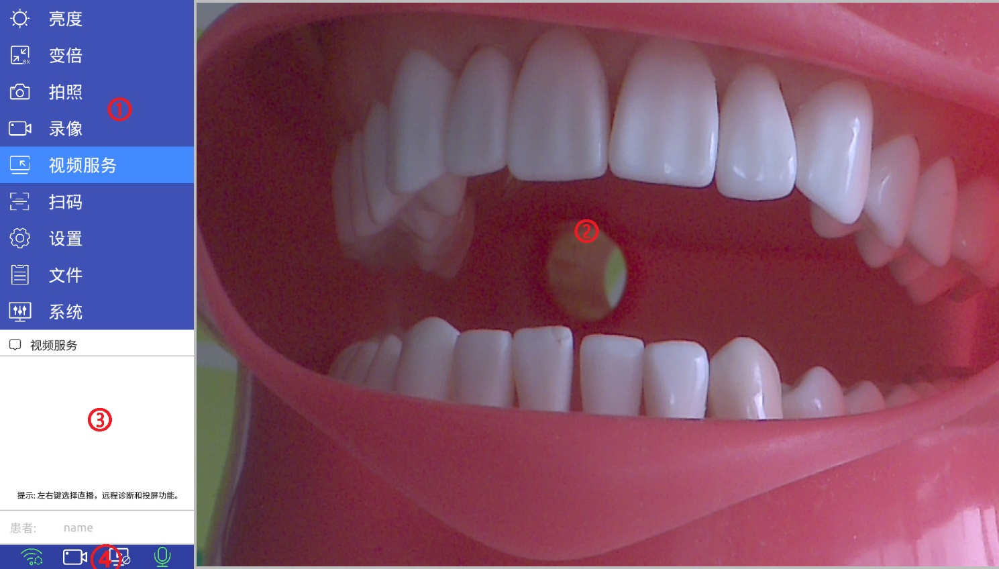

# 
口腔摄录直播系统使用说明书

---
## 窗口分布
> 如下所示，系统窗口由 ①控制区 ②图像区 ③信息区 ④状态区 四块区域组成：

- 命令区的所有功能都可以通过灯头右侧的五向键操作，常用功能可通过语音控制。
- 图像区显示影像及拍照预览，可以旋转180度显示。
- 信息区显示对应功能的详细信息，包括URL，文件容量，版本，Wifi等。
- 状态区显示Wifi 连接状态，录像状态，视频服务状态及语音控制状态。

window {#1}

## 1. 亮度调节 {#1}
> 亮度调节是指能够调整灯的亮度，按一下左键，亮度降低一级，按一下右键，亮度调高一级。语音控制指令&quot;灯亮度高&quot;&quot;灯亮度中&quot;&quot;灯亮度低&quot;。

> 开启&quot;自动人像&quot;后,当口腔灯调整到水平视角后，会自动关灯；恢复至非水平视角后，会自动回到之前的亮度。

## 2. 镜头变倍 {#heading-2}
> 镜头变倍是指调整镜头的缩放，按一下左键，镜头缩小一级，按一下右键，镜头放大一级。语音控制指令&quot;请放大&quot;&quot;请缩小&quot;。
>
> 当前放大级数显示在图标上，默认7 级放大。
> 8级与9级是数字放大，此状态下可改善远距离观察体验，不会提升照片及录像质量。

> 开启&quot;自动人像&quot;后,当口腔灯调整到水平视角后，会自动将放大级数设为1级；恢复至非水平视角后，会自动回到之前的放大级数。

## 3. 拍照

> - 按中心按键拍照，保存图片。语音控制指令&quot;请拍照&quot; 。 
> - 拍照后可以保持静止，确认照片质量，满意后再继续显示；如需此功能，可在设置中开启&quot;截屏保持&quot;。  
> - 照片可通过文件-\&gt;地址中显示的URL 访问保存，可清除全部照片腾出存储空间 。 
> - 照片中或屏幕上显示&quot;BL&quot;表示此点是患者的左下角；&quot;TR&quot;表示右上角。

## 4. 录像

> - 按中心按键开始录像，再按一次停止录像。语音控制指令&quot;请开始录像&quot;，&quot;请停止录像&quot;。
> - 录像中有状态提示，有剩余空间提示。
> - 录像可通过文件-\&gt;地址中显示的URL 访问保存，可清除全部录像腾出存储空间。

## 5. 视频服务

> 分为：投屏，视频通话，直播功能，按一下左键或者右键，进行功能选择，按中间键，确认使用该功能。

### 5.1 投屏功能
1. 需要有电视盒或者其他投屏设备；设备上面请安装乐播投屏软件；
2. 在电视盒或者投屏设备上面，打开乐播软件，确认显示的设备名称；
3. 在口腔灯上，通过左右按键，选择到投屏选项，然后按下中间确认键，确认开启投屏功能；
4. 在口腔灯投屏选项右侧会出现局域网里，能够投屏的设备，选择和乐播软件显示的相同的设备名称，点击确认按钮，进行投屏连接；
5. 在电视盒和投屏设备上，能够展示口腔灯拍到的画面；此时在软件界面的左下侧，小电脑图标变成绿色，表示连接成功；如果投屏设备上视频一直卡住，则可以通过菜单栏，选择&quot;硬解码播放&quot;，可以解决连接不稳定，黑屏问题；
6. 在投屏选项上，再按一次确认键，则退出投屏，在软件左下侧，小电脑图标变成白色；
7. 如果投屏时选择&quot;Any Device&quot;，可在PC 端使用软件(例如VLC)拉取视频；视频URL 显示在左下角信息框内。

### 5.2 直播功能(以快手为例)：  
1. 首先注册快手账号，并且申请实名认证，开通直播功能；  
2. 使用PC或笔记本打开快手后台网页studio.kuaishou.com，登录后台。  
3. 进入页面后，点击&quot;我的直播&quot;，然后选择&quot;创建直播&quot;，在创建直播页面找到&quot;推流信息&quot;，将&quot;RTMP服务器&quot;和&quot;直播码/串流密钥&quot;拷贝出来，然后拼接成一行。  
> 例如：
> rtmp://open-push.voip.yximgs.com/gifshow/kwai\_actL\_ol\_act\_8945653062\_strL\_origin?sign=61ee2c5f-83ad2993aa4fe956785fbc78bffcd359&amp;ks\_fix\_ts  
4. 访问&quot;草料二维码&quot;网页，将拼接好的字符串，生成二维码；  
5. 在口腔灯设备上，选择&quot;直播&quot;，出现扫描框时，扫描生成的二维码。在应用程序左下角直播图标会变绿，表示已经开始推流直播了。  
6. 在&quot;快手后台网页&quot;，刷新直播控制界面，出现口腔灯显示图像后，在&quot;直播控制界面&quot;，选择开启直播。  
7. 登陆手机快手应用程序，找到自己的用户号，就可以看直播视频了。

### 5.3 视频通话
1．首先通过手机或笔记本登陆网页&quot;https://app.langsee.cn/videocall/&quot;，然后点击&quot;开始&quot;，生成二维码；  
2．在口腔灯上选择&quot;视频通话&quot;，出现扫描框后，扫描生成的二维码，扫描成功后，则视频通话开始运行；  
3．点击&quot;挂断&quot;，可以结束通话；

## 6. 扫码服务

> 分为：网络配置和用户ID操作

### 6.1 网络配置  
1. 首先通过手机登陆网页&quot;https://app.langsee.cn/qrcode/&quot;，在&quot;WiFi名称&quot;输入框里面输入要连接到的wifi名字，在&quot;WiFi密码&quot;输入框里面输入wifi的密码，然后点击&quot;生成二维码&quot;，生成二维码。  
2. 选择口腔灯，扫码—》网络配置，点击中间按键，出现扫描框后，扫描生成的二维码，扫描成功后，网络就能连接好。  
3. 推荐使用安卓手机的Wifi信息中生成的二维码，以防输入错误。

### 6.2 用户ID操作  
> 选择口腔灯，扫码—》用户ID，在出现扫描框后，将表示用户数据的条形码，放到口腔灯下，进行扫描，扫描成功后，会在界面左下角，&quot;患者&quot;处，显示用户的ID;

## 7. 系统设置

### 7.1 自动人像  
> 自动人像开启后，口腔灯可以在操作台和正对人脸状态，进行相关切换，默认开启。

1. 选择&quot;自动人像&quot;，图标变灰后，表示自动人像开启；
2. 当口腔灯处于完全水平状态，对准人脸时，图像调整为正向，正对着人的图像；此时放大级数变为一级并关灯；
3. 当口腔灯回到非水平位置后，恢复之前的放大、亮度及图像方向；

### 7.2 光圈调整

> 选择&quot;光圈调整&quot;，按口腔灯中间键，可以在大光圈和小光圈模式间，进行状态切换；默认大光圈状态。

### 7.3 稳像
> 选择&quot;稳像&quot;后，口腔灯在轻微抖动时，图像能够去消除抖动，使图像平稳显示；默认关闭。

### 7.4 光源

> 选择&quot;光源&quot;,口腔灯可以在治疗和光固化模式来回切换，语音指令&quot;请开启光固化&quot;，&quot;请关闭光固化&quot;。

### 7.5 抖动对焦

> 系统默认在灯头移动或抖动时重新对焦，可以关闭此特性，只使用语音对焦。

### 7.6 图像翻转

> 图像180度旋转，语音指令&quot;请翻转图像&quot;。

### 7.7 截屏保持

> 此功能开启后，拍照后照片会静止在屏幕上供确认，之后语音&quot;请继续&quot;或者移动光标继续。

## 8. 文件操作

> 拍摄的照片和视频文件保存在设备上，设备的可用空间可以会显示在信息区。当剩余空间不足时，请将文件通过手机或者PC 备份，然后清理再开始拍摄。

### 8.1 清理图片

> 选择&quot;清理图片&quot;，按口腔灯中间确认按键，则可以将设备中的所有图片全部清除掉；

### 8.2 清理视频

> 选择&quot;清理视频&quot;，按口腔灯中间确认按键，则可以将设备中的所有视频全部清除掉；

### 8.3 文件地址

> 选择&quot;文件地址&quot;，可以看到生成的二维码，然后在手机打开网页，选择扫描功能，可以扫描二维码，就可以在网页上显示图片文件和视频文件了；

> 在PC端也可以登录网页，然后输入&quot;文件地址&quot;，可以在PC上面浏览设备图片和视频；

## 9. 系统功能

### 9.1 关机

> 选择&quot;关机&quot;，口腔灯，能够正常完成关机操作；软件关机后再次启动需要切断电源一分钟以上，然后再打开电源。

### 9.2 软件更新

> 选择&quot;系统设置&quot;-\&gt;&quot;软件更新&quot;，可以在左下角看到，&quot;当前安装版本&quot;和&quot;最新发布版本&quot;，如果&quot;最新发布版本&quot;比&quot;当前安装版本&quot;高，则可以启动软件更新；

> 操作口腔灯中间按键，进行&quot;软件更新&quot;，系统会自动更新软件，成功后，会自动重启，更新后，&quot;最新发布版本&quot;和&quot;当前安装版本&quot;会一致；

### 9.3 语言设置

> 选择&quot;语言设置&quot;，点击口腔灯中间按键，然后可以在中文和英文之间来回切换；

## 语音控制口令说明
- 正常启动，语音控制是开启的；
- 开启灯光，说&quot;请开灯&quot;；
- 关闭灯光，说&quot;请关灯&quot;；
- 拍照，说&quot;请拍照&quot;；
- 拍照静止后继续，说&quot;请继续&quot;；
- 开始录像，说&quot;请开始录像&quot;；
- 停止录像，说&quot;请停止录像&quot;；
- 放大图像，说&quot;请放大&quot;，则镜头伸长，图像放大显示；
- 缩小图像，说&quot;请缩小&quot;，则镜头缩短，图像缩小显示；
- 翻转图像，说&quot;请翻转&quot;；
- 灯光亮度调整，说&quot;灯亮度低&quot;，&quot;灯亮度中&quot;，&quot;灯亮度高&quot;，可以实现灯光强弱调节；
- 对焦功能，说&quot;请对焦&quot;；
- 开启光固化，说&quot;开启光固化&quot;，则可以灯源切换到光固化灯光模式；
- 关闭光固化，说&quot;关闭光固化&quot;，则可以灯源切换到普通治疗灯光模式；
- 开启语音控制和关闭语音控制；说&quot;请开启语音控制&quot;，&quot;请关闭语音控制&quot;。
